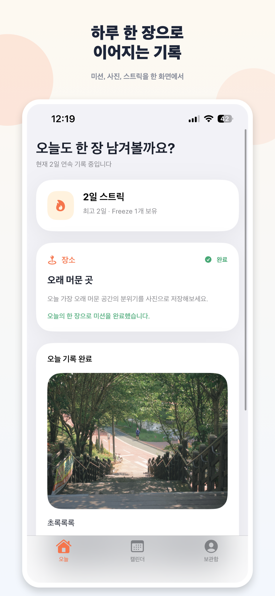
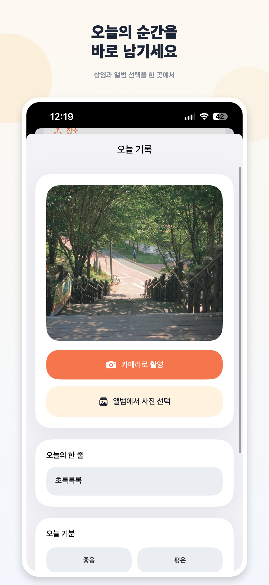
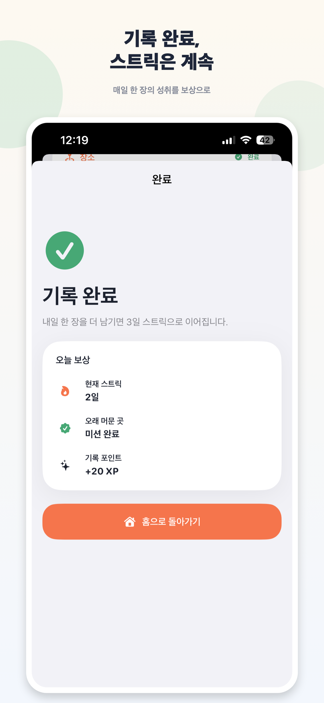
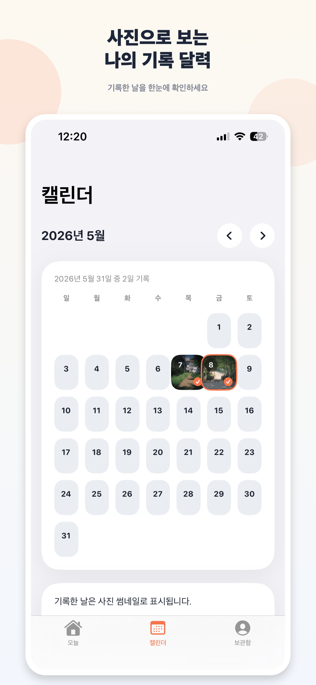

# DailyFrame

> 하루 한 장의 사진으로 오늘을 기록하고, 미션과 스트릭으로 다시 돌아오게 만드는 iOS 습관 앱입니다.


## Product Snapshot

DailyFrame은 공개 피드나 실시간 인증보다 `개인 기록`, `로컬 저장`, `빠른 기록 루프`에 집중합니다. 사용자는 매일 한 장의 사진과 짧은 메모를 남기고, 앱은 미션, 스트릭, 캘린더 아카이브로 기록을 이어갈 이유를 제공합니다.

| Today | Capture | Complete | Calendar |
| --- | --- | --- | --- |
|  |  |  |  |

## Highlights

- **Habit loop**: 오늘의 미션, 기록 완료 보상, 스트릭 상태를 한 화면에서 확인합니다.
- **Photo-first archive**: 기록한 날은 캘린더에서 사진 썸네일로 보이며 상세 기록으로 이어집니다.
- **Local-first persistence**: 개인 기록 앱의 성격에 맞게 로컬 저장소 중심으로 설계했습니다.
- **Media handling**: 원본 이미지와 썸네일을 분리 저장하고, 앱 시작 시 미디어 정리를 수행합니다.
- **Notification settings**: 매일 기록 알림과 시간 설정을 프로필 화면에서 관리합니다.
- **Localization**: 한국어, 영어, 일본어 문자열 리소스를 분리해 다국어 확장을 고려했습니다.

## Tech Stack

| Area | Implementation |
| --- | --- |
| Platform | iOS 18.5+ |
| Language | Swift 5 |
| UI | SwiftUI, SF Symbols, custom design tokens |
| Architecture | MVVM + service/repository layer |
| Persistence | Local JSON/file storage |
| Media | PhotosPicker, camera capture, thumbnail storage |
| Tests | XCTest unit tests for streak behavior |

## Architecture

```text
DailyFrame/
├── App/                 # RootView, tab composition
├── DesignSystem/        # Color, spacing, card primitives
├── Features/            # Home, Calendar, EntryEditor, EntryDetail, Profile, Onboarding
├── Models/              # Entry, mission, streak, settings, profile models
├── Services/            # Mission, streak, notification, media, persistence services
├── Utilities/           # Date formatting and localization helpers
└── *.lproj/             # KO / EN / JA localized resources
```

The code separates user-facing screens from app rules. View models orchestrate repositories and services, while persistence and media responsibilities remain behind focused service types.

## Core Flows

1. **Onboarding** introduces the one-photo habit concept.
2. **Home** shows the current streak, today's mission, today's entry, monthly progress, and recent records.
3. **Entry editor** supports photo library import, camera capture, memo, mood, and save validation.
4. **Completion** confirms the reward state and next streak goal.
5. **Calendar** visualizes saved days as image thumbnails.
6. **Archive/Profile** summarizes record counts, best streak, current streak, and reminder settings.

## Quality Notes

- Streak recalculation is covered by unit tests in `DailyFrameTests/StreakServiceTests.swift`.
- Repeatable feature-complete smoke coverage is defined in `docs/qa-smoke-checklist.md`.
- UI copy is localized through `Localizable.strings` instead of hard-coded in feature views.
- Personal media is stored locally; public feed, account system, and backend sync are intentionally out of MVP scope.
- App Store style screenshots are kept in `AppStoreScreenshots/` so reviewers can understand the product without opening Xcode.

## Run Locally

1. Open `DailyFrame/DailyFrame.xcodeproj` in Xcode.
2. Select the `DailyFrame` scheme.
3. Run on an iOS 18.5+ simulator or device.

CLI verification:

```bash
xcodebuild test \
  -project DailyFrame/DailyFrame.xcodeproj \
  -scheme DailyFrame \
  -destination 'platform=iOS Simulator,name=iPhone 16'
```

## Roadmap

- [ ] Add richer entry search/filtering in the archive.
- [ ] Add lightweight weekly review insights.
- [ ] Expand widget and reminder surfaces.
- [ ] Add iCloud sync after the local-first MVP is stable.

## Repository Workflow

- Commit messages use `type(scope): Korean summary`.
- Keep one intent per commit.
- Do not commit Xcode user state or build artifacts.
- Verify relevant build/tests before merging.
